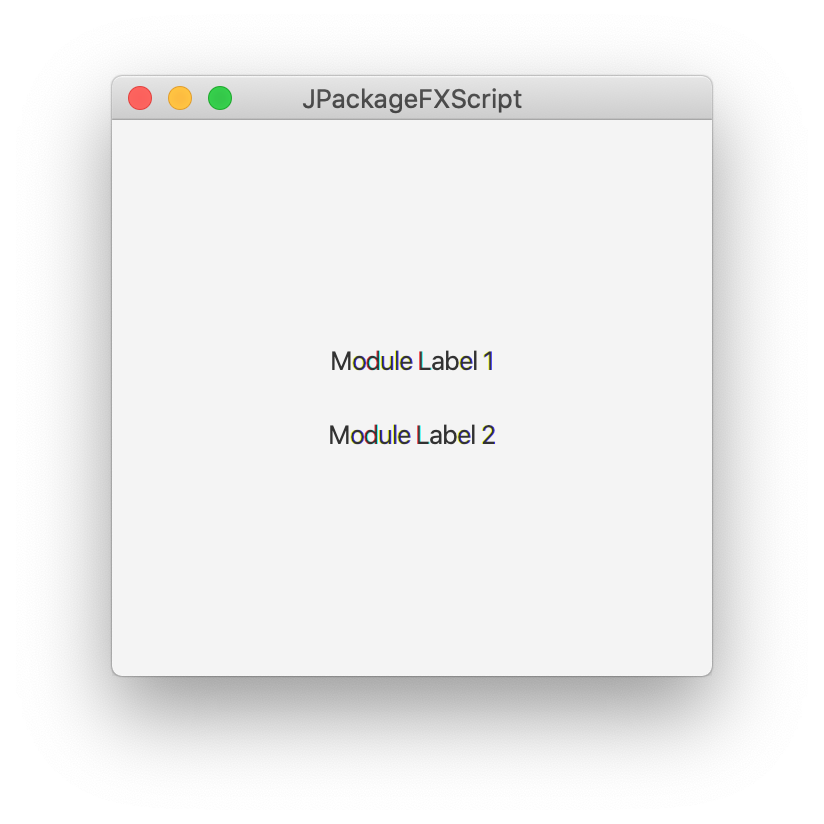

# JPackageScriptFX #

<a href="https://foojay.io/today/works-with-openjdk"></a>

This project demonstrates how projects can use scripts to build self-contained, platform-specific executables and 
installers of their JavaFX applications via the `jdeps`, `jlink`, and `jpackage` tools. Two scripts are included for 
running builds on Mac/Linux and Windows. The `jpackage` tool is bundled with the JDK since version 14.

Important: the scripts do not try to create a fully modularized solution but instead try to enable existing
projects / applications, which often use non-modularized 3rd party dependencies, to be packaged again after the
previous packaging tool stopped working since Java 11.

### Prerequisites

* Any OpenJDK 17 Installation ([download from AdoptOpenJDK](https://adoptopenjdk.net)) 
* On Windows you need to have the WIX toolset installed (https://wixtoolset.org)

### Environment

Both platform-specific build scripts need to know where they can find the java installation with the jpackage tool.
Therefore you have to set the environment variable `JAVA_HOME`. How you set it depends
on your operating system. On Mac/Linux you can set it inside the .bash_profiles file in your user home directory. On Windows
you would set it in the "environment variables" dialog. In your IDE you can normally also set it as part of a
Maven run configuration. If you are the only one working on the project then you can even add it to the pom.xml file of
the main module. 

### Project Structure

The project in this repository uses a multi-module Maven setup with a parent module containing three child modules.
One of these child modules is the "main" module as it contains the main class. This module also contains the build
scripts and its target directory will contain the results of the build. The JavaFX application consists of a single
window displaying three labels. The first one shows the currently configured locale and the other two labels get
imported from module 1 and module 2 respectively.



### Launcher Class

Upon closer inspection you will notice that the scripts are not creating packages and executables for `App` (which 
extends the standard JavaFX `Application` class) but for `AppLauncher`. When an `Application` class gets launched then 
JavaFX will check whether the JavaFX modules are present on the module path. But since we are placing them on the 
classpath the application can not launch. As a work-around we are starting a standard Java class with a main method in 
it. This prevents the module path check and the application will launch just fine without us having to provide any of
the module system specific options.

### Icons

Executables require an application icon. Default icons are part of the project. Feel free to use it for your 
development efforts but make sure to replace it with your own before shipping your product. The platform-specific
icons can be found inside `jpackagefx-main/src/main/logo`.

### Building the Project

Once your environment is set up you can simply call the `mvn clean install` on the root / parent module. It will do
a standard build of the application and in addition it will analyze all the dependencies and copy the resulting set of
JAR files into the folder target/libs. This work is done via the Maven dependency plugin. Once the standard build is 
completed Maven will invoke the shell script (on Mac/Linux) or the batch script (on Windows). The Maven  main-ui/pom.xml uses two 
different profiles, both of them being activated via the OS that they are running on.

The scripts both have the same structure:
* Environment
* Dependency Analysis
* Runtime Image Generation
* Packaging

### Environment

The required environment for the scripts consists of environment variables and a directory structure. The following
variables are used:

* JAVA_HOME - the location of the JDK matching the Java version
* JAVA_VERSION - defines the runtime environment that the final application is targeting
* PROJECT_VERSION - the version of the project as defined in the pom.xml file (e.g. 1.0-SNAPSHOT)
* APP_VERSION - the version for the executable (careful: do not re-use project version. The supported Windows version 
  number format has to be major.minor.build, e.g. 1.0.2412. Mac seems to be more flexible.)
* MAIN_JAR - the name of the jar file that contains the main class
  
The directory structure required by the build:

* `target/java-runtime` - contains the runtime environment generated by jlink as part of the build
* `target/installer` - contains the executables generated by jpackage as part of the build
* `target/installer/input/libs` - contains the jars required by the application to run
 
### Dependency Analysis

The scripts use the `jdeps` tool to analyze the dependencies of the application to determine which modules need to
be included in the final package. These modules are stored in the list `detected_modules`. 

```bash
detected_modules=$JAVA_HOME/bin/jdeps
  --multi-release ${JAVA_VERSION}
  --ignore-missing-deps
  --print-module-deps
  --class-path "target/installer/input/libs/*"
    target/classes/com/dlsc/jpackagefx/App.class
```

However, the tool can not always find all modules via this static analysis. E.g., when they are only 
needed to provide a specific service implementation, some manual intervention is required. For this you can add modules 
to the comma-separated list called `manual_modules`.

If your application is localized you should also always add `jdk.localedata` to this list.
This can be reduced to the actually needed locales via a jlink paramter later, e.g., `--include-locales=en,de`.

```bash
manual_modules=,jdk.crypto.ec,jdk.localedata
```

### Runtime Image Generation

The next tool to call is called `jlink`. It generates a java runtime environment for our application and places its content
inside the folder target/java-runtime. We could have relied on `jpackage` to perform the linking for us but unfortunately
it does not behave very well with automatic modules, yet. So in order to have full control over the image generation we
are letting the script do it via `jlink`.

```bash
$JAVA_HOME/bin/jlink
  --no-header-files
  --no-man-pages 
  --compress=2 
  --strip-debug
  --add-modules "${detected_modules}${manual_modules}"
  --include-locales=en,de
  --output target/java-runtime
```
    
In our example code whe have added the module `jdk.crypto.ec`, which would be needed to make https-requests.
But this is just an example here because the code does not actually make use of it.

If you want to stay on the safe side or if you experience strange errors, which might be due to some missing
service providers, you can add the option `--bind-services` to the `jlink` command.
This will, however, make the resulting image much bigger because it will include all service implementations
and not just the ones that you actually need.

The `jlink` command has an option `--suggest-providers` which, without any further parameters, just outputs a list
of all service providers on the module path (by default the whole JDK), but that list is far too long and unspecific to be really useful.
In a variant of this option you can explicitly specify a service interface and you will get a list of all implementors
of this interface but that implies that you have to know all relevant service interfaces which are possibly used deep down
in your dependencies or the JDK. So, at the moment this remains a try-and-error game.
    
### Packaging

#### Basics

Finally we are invoking the `jpackage` tool in a loop so that it generates all available package types for the platform
that the build is running on. Please be aware that `jpackage` can not build cross-platform installers. The build has to
run separately on all platforms that you want to support. When the build is done you will find the installers inside
the directory `target/installer`. On Mac you will find a DMG, PKG, or an APP. On Linux a DEB, RPM or an application directory.
On Windows you will find an application directory, an EXE, and an MSI. Please be aware that the EXE is not the application
itself but an installer.

```bash
for type in "app-image" "dmg" "pkg"
do
  $JPACKAGE_HOME/bin/jpackage
  --package-type $type
  --dest target/installer
  --input target/installer/input/libs
  --name JPackageScriptFX
  --main-class com.dlsc.jpackagefx.AppLauncher
  --main-jar ${MAIN_JAR}
  --java-options -Xmx2048m
  --runtime-image target/java-runtime
  --icon src/main/logo/macosx/duke.icns
  --app-version ${APP_VERSION}
  --vendor "ACME Inc."
  --copyright "Copyright © 2019-21 ACME Inc."
  --mac-package-identifier com.acme.app
  --mac-package-name ACME
done
```

#### Customization

Once you have come this far, you can now consider to customize your packaging.
Under the hood the `jpackage` tool uses platform-specific tooling to create the various package types.
The customization of the packaging is therefore also very platform-specific and has to be individually
for each supported platform and package type. However, there are two common features of `jpackage` that you can use to make this task easier.

The first one is the option `--temp some_temp_dir` which asks `jpackage` to copy all scripts and resources needed to create the selected package type into a directory `some_temp_dir`. These are the scripts and resources that `jpackage` would use by default.

The second one is the option `--resource-dir some_resource_dir` which asks `jpackage` to first look
for resources in the directory `some_resource_dir` and then use its defaults only for the ones it does not find there.

With these two options you can first generate a set of default resources from which you can pick the ones you want to modify and copy them over to the directory `some_resource_dir`. In a second run of
`jpackage` you can then apply these changes. The most likely changes you can make this way is to exchange
the default icons, used by the various package types, with your own ones.

We do not yet provide an example for these customizations because this is still work in progress and there are
still some problems.
